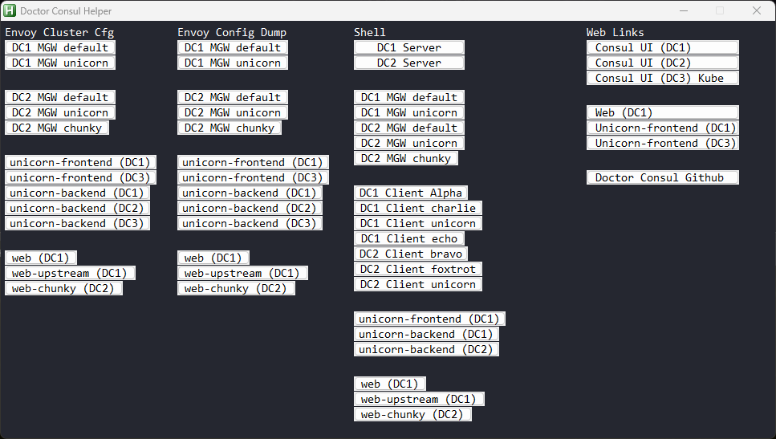

# doctorconsul-helper

This is a helper application for collecting stats from [Doctor Consul](https://github.com/joshwolfer/doctorconsulhttps:/)

Doctor Consul Helper is a UI that allows you to quickly collect data from various running containers in the Doctor Consul environment.

* Doctor Consul Helper is built via AutoHotKey (AHK) and is Windows only.

# Pre-Requirements

* Windows (any version)
* [AutoHotKey](https://www.autohotkey.com/) must be installed on the Windows workstation.
* vsc script placed in your executable path.
  * The script file is place in the root of this repo.
* [Microsoft Visual Studio Code](https://code.visualstudio.com/download)

# How to use Doctor Consul Helper

Doctor Consul establishes many forwarded ports into the local workstation that allows connectivity directly into the Application / Gateway Envoy proxies. The helper makes it easier to gather stats from the intended proxy without having to correlate the ports list and hand write the command.

* Run the doctorconsul-helper.ahk script.
* The helper UI is launched.
* Clicking on one of the buttons results in the appropriate command being placed in the Window copy buffer.
* Paste into the shell
* The intended data is opened up directly in Microsoft Visual Studio Code.

Additional troubleshooting commands will likely be added to the helper in the future.

## vsc script

The vsc script takes STDIN input, drops it into a temporary file, and opens up the file in Microsoft VSC.

VSC is supposed to be able to open up STDIN directly, but it doesn't work correctly, and thus this script needed to be written. I don't recall the exact issues I ran into.

Syntax

> vsc *[file extension]*

The file extension will allow vsc to use the correct syntax coloring.
