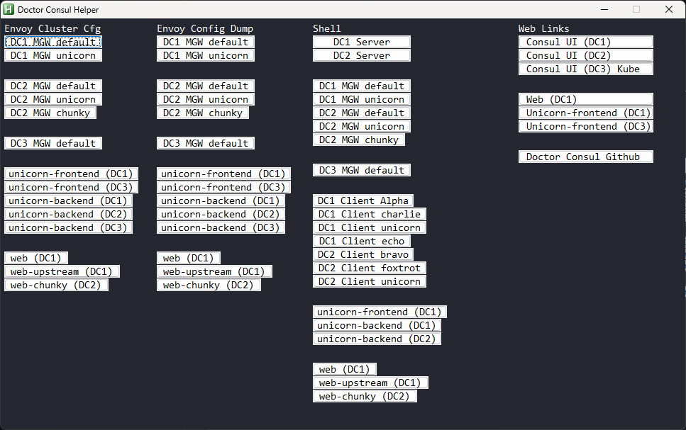

# doctorconsul-helper

This is a helper application for collecting stats from [Doctor Consul](https://github.com/joshwolfer/doctorconsulhttps:/)

Doctor Consul Helper is a UI that allows you to quickly collect data from various running containers in the Doctor Consul environment.

* Doctor Consul Helper is built via AutoHotKey (AHK) and is Windows only.

# Pre-Requirements

* Windows (any version)
* AutoHotKey must be installed on the Windows workstation. See [AHK](https://www.autohotkey.com/https:/)
* vsc script placed in your executable path.
  * The script file is place in the root of this repo.

# How to use Doctor Consul Helper

Doctor Consul establishes many forwarded ports into the local workstation that allows connectivity directly into the Application / Gateway Envoy proxies. The helper makes it easier to gather stats from the intended proxy without having to correlate the ports list and hand write the command.

* Run the doctorconsul-helper.ahk script.
* The helper UI is launched.
* Clicking on one of the buttons results in the appropriate command being placed in the Window copy buffer.
* Paste into the shell

Additional troubleshooting commands will likely be added to the helper in the future.
